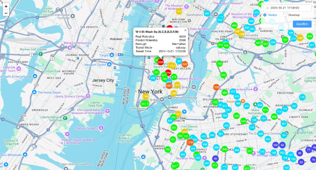

# ML Final Project (subway_ridership_analysis)
### Overview

### Project Structrue

### Model Training
**Dataset URL:** https://data.ny.gov/Transportation/MTA-Subway-Hourly-Ridership-Beginning-July-2020/wujg-7c2s/about_data

**Dataset Local Path:** LSTM/data(we did't uploud the dataset file beacuse its size is large, 6.8GB)

**Data Analysis Code:** LSTM/note

**Model Traning Code**:  
LSTM/src/DataPreprocess.py  
LSTM/src/TraningModel2.py  
We want to apply dynamic modle in the future work by setting a timer to train the model with the lasest data periodcally. So we chose .py to write traning data code rather .ipynb.

**Model Save Folder**:LSTM/ml_model

### Backend
**Local Path:** LSTM/src/flask  
Run run.py to lunch the server.
### Frontend
**Local Path:** frontend  
**Step1 open frontend folder:** ```cd frontend```  
**Step2 install modules:** ```npm intsall```  
**Step3 lunch frontend server:** ```npm run dev```


